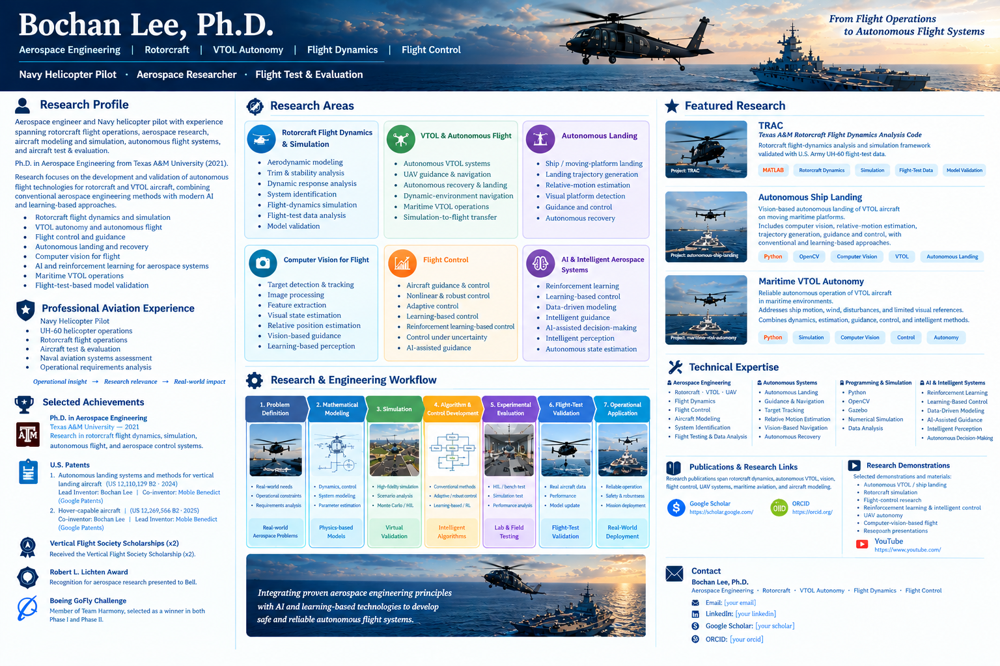

# Bochan Lee, Ph.D.

### Aerospace Engineering | Rotorcraft | VTOL Autonomy | Flight Dynamics | Flight Control

**Navy Helicopter Pilot · Aerospace Researcher · Flight Test & Evaluation**

---

## Research Profile

Aerospace engineer and Navy helicopter pilot with experience spanning **rotorcraft flight operations, aerospace research, aircraft modeling and simulation, autonomous flight systems, and aircraft test & evaluation**.

Ph.D. in Aerospace Engineering from **Texas A&M University (2021)**.

Research focuses on the development and validation of autonomous flight technologies for rotorcraft and VTOL aircraft, combining **conventional aerospace engineering methods with modern AI and learning-based approaches**.

Key research areas include:

* Rotorcraft flight dynamics and simulation
* VTOL autonomy and autonomous flight
* Flight control and guidance
* Autonomous landing and recovery
* Computer vision for flight
* AI and reinforcement learning for aerospace systems
* Maritime VTOL operations
* Flight-test-based model validation

The research approach connects **mathematical modeling, simulation, algorithm development, intelligent systems, experimental evaluation, and flight-test validation** to address real-world aerospace problems.

---

# Research Areas

## Rotorcraft Flight Dynamics & Simulation

* Rotorcraft aerodynamic and flight-dynamics modeling
* Aircraft trim and stability analysis
* Dynamic response analysis
* System identification
* Flight-dynamics simulation
* Flight-test data analysis
* Model validation

## VTOL & Autonomous Flight

* Autonomous VTOL systems
* UAV guidance and navigation
* Autonomous recovery and landing
* Dynamic-environment navigation
* Maritime VTOL operations
* Simulation-to-flight transfer

## Autonomous Landing

* Autonomous ship landing
* Moving-platform landing
* Landing trajectory generation
* Relative-motion estimation
* Visual landing-platform detection
* Guidance and control for autonomous recovery

## Computer Vision for Flight

Research spans both **conventional image-processing techniques and modern learning-based perception methods**, including:

* Target detection and tracking
* Image processing
* Feature extraction
* Visual state estimation
* Relative position estimation
* Vision-based guidance
* Learning-based visual perception

## Flight Control

Research combines **conventional flight-control methodologies with adaptive, robust, and learning-based approaches**.

* Aircraft guidance and control
* Flight-control system development
* Nonlinear and robust control
* Adaptive control
* Learning-based control
* Reinforcement learning-based control
* Control under uncertainty and disturbances
* AI-assisted guidance and decision-making

## AI & Intelligent Aerospace Systems

Application of AI and machine learning to aerospace systems, including:

* Reinforcement learning
* Learning-based control
* Data-driven modeling
* Intelligent guidance
* AI-assisted decision-making
* Intelligent perception
* Autonomous state estimation
* Integration of AI with conventional aerospace control methods

---

# Featured Research

## TRAC

### Texas A&M Rotorcraft Flight Dynamics Analysis Code

**TRAC** is a rotorcraft flight-dynamics analysis and simulation framework developed during doctoral research at Texas A&M University.

The framework addresses rotorcraft modeling, trim analysis, dynamic response, and flight-dynamics simulation, with validation against **U.S. Army UH-60 flight-test data**.

### Key Capabilities

* Rotorcraft flight-dynamics modeling
* Aircraft trim analysis
* Stability and response analysis
* Flight-condition analysis
* Flight-test data comparison
* Simulation-to-flight validation

**Technical Focus:**
`Python` · `Rotorcraft Dynamics` · `Simulation` · `Flight-Test Data` · `Model Validation`

**Project:** `TRAC`

---

## Autonomous Ship Landing

Research on autonomous landing of VTOL aircraft on **moving maritime platforms**.

The research integrates computer vision, relative-motion estimation, trajectory generation, guidance, and flight control to address autonomous recovery in a dynamic maritime environment.

The work incorporates both **conventional estimation and control methods and intelligent / learning-based approaches** for perception, guidance, and autonomous decision-making.

### Research Components

* Visual landing-platform detection
* Target tracking
* Relative position estimation
* Landing trajectory generation
* Guidance and control
* Dynamic-platform compensation
* Autonomous recovery
* Intelligent perception and decision-making

**Technical Focus:**
`Python` · `OpenCV` · `Computer Vision` · `VTOL` · `Autonomous Landing`

**Project:** `autonomous-ship-landing`

---

## Maritime VTOL Autonomy

Research direction focused on reliable autonomous operation of VTOL aircraft in maritime environments.

Key challenges include:

* Moving landing platforms
* Ship motion
* Wind and atmospheric disturbances
* Limited visual references
* Dynamic relative motion
* Autonomous recovery

The research combines aircraft dynamics, estimation, guidance, control, computer vision, and intelligent algorithms to improve the reliability of autonomous VTOL operations in constrained environments.

---

# Flight-Test & Operational Perspective

A distinctive component of the research background is the combination of **rotorcraft flight experience, aerospace research, and aircraft test & evaluation**.

Professional aviation experience includes:

* **Navy Helicopter Pilot**
* **UH-60 helicopter operations**
* Rotorcraft flight operations
* Aircraft test & evaluation
* Naval aviation systems assessment
* Operational requirements analysis

This experience provides an operational perspective on the relationship between:

**Aircraft Design → Flight Characteristics → System Performance → Test & Evaluation → Operational Requirements**

The research philosophy emphasizes not only whether an algorithm performs well in simulation, but also whether its assumptions and performance remain meaningful under **real aircraft dynamics, uncertainty, disturbances, and operational constraints**.

---

# Research & Engineering Workflow

  

The research workflow emphasizes the transition from **real-world aerospace problems to validated engineering solutions**.

**Problem Definition → Mathematical Modeling → Simulation → Algorithm & Control Development → Experimental Evaluation → Flight-Test Validation → Operational Application**

The methodology supports both **conventional aerospace engineering approaches and modern AI / learning-based methods**, depending on the characteristics of the problem.

---

# Technical Expertise

## Aerospace Engineering

`Rotorcraft` · `VTOL` · `UAV` · `Flight Dynamics`
`Flight Control` · `Aircraft Modeling` · `System Identification`
`Flight Testing` · `Flight-Test Data Analysis`

## Autonomous Systems

`Autonomous Landing` · `Guidance` · `Navigation`
`Target Tracking` · `Relative Motion Estimation`
`Vision-Based Navigation` · `Autonomous Recovery`

## Programming & Simulation

`Python` · `OpenCV` · `Gazebo`
`Numerical Simulation` · `Data Analysis`

## AI & Intelligent Systems

`Artificial Intelligence` · `Machine Learning`
`Reinforcement Learning` · `Learning-Based Control`
`AI-Assisted Guidance` · `Intelligent Decision-Making`
`Data-Driven Modeling` · `Intelligent Perception`

---

# Selected Achievements

## Ph.D. in Aerospace Engineering

**Texas A&M University — 2021**

Research in rotorcraft flight dynamics, simulation, autonomous flight, and aerospace control systems.

## U.S. Patents

### Autonomous landing systems and methods for vertical landing aircraft

**U.S. Patent US 12,110,129 B2 · 2024**

**Lead Inventor:** Bochan Lee
**Co-inventor:** Moble Benedict

[Google Patents](https://patents.google.com/patent/US12110129B2/en)

### Hover-capable aircraft

**U.S. Patent US 12,269,586 B2 · 2025**

**Co-inventor:** Bochan Lee
**Lead Inventor:** Moble Benedict

[Google Patents](https://patents.google.com/patent/US12269586B2/en)

## Robert L. Lichten Award

Recognition for aerospace research presented to **Bell** headquarters.

## Boeing GoFly Challenge

Member of **Team Harmony**, selected as a winner in both **Phase I and Phase II** of the Boeing GoFly Challenge.

---

# Publications

Research publications span:

* Rotorcraft flight dynamics
* Helicopter simulation
* Autonomous VTOL systems
* Autonomous landing
* Flight control
* Reinforcement learning and learning-based control
* Computer vision and intelligent perception
* UAV systems
* Maritime aviation
* Aircraft modeling and validation

**[Google Scholar](YOUR_GOOGLE_SCHOLAR_LINK)**

**[ORCID](YOUR_ORCID_LINK)**

---

# Research Demonstrations

Selected technical demonstrations and research materials:

* Autonomous VTOL / ship landing
* Rotorcraft simulation
* Flight-control research
* Reinforcement learning and intelligent control
* UAV autonomy
* Computer-vision-based flight
* Research presentations

**[YouTube](YOUR_YOUTUBE_LINK)**

---

# Future Research Directions

## Autonomous Rotorcraft

Development of autonomous flight systems capable of operating safely in uncertain and dynamic environments.

## Maritime VTOL Autonomy

Autonomous landing and recovery of VTOL aircraft on moving ships and maritime platforms.

## Vision-Based Flight Control

Integration of computer vision, state estimation, guidance, and control for autonomous aircraft.

## Learning-Based Aerospace Control

Investigation of reinforcement learning and machine-learning approaches for adaptive, robust, and intelligent aerospace control.

## Intelligent Autonomous Systems

Integration of AI, machine learning, perception, estimation, and conventional aerospace engineering methods to develop reliable autonomous flight systems.

## Simulation-to-Flight Transfer

Development of methodologies for transferring autonomous-flight algorithms from simulation to real aircraft.

## Human-Autonomy Integration

Development of autonomous systems that enhance pilot and operator capabilities while maintaining appropriate levels of human oversight and system reliability.

---

# Research Vision

### **Bridging Aerospace Engineering, Autonomous Systems, Flight Testing, and Real-World Operations**

The long-term research direction centers on **intelligent, reliable, and flight-test-validated autonomous VTOL systems**.

The research integrates established aerospace engineering principles with emerging AI and learning-based technologies across:

1. Environmental perception
2. Aircraft state estimation
3. Relative-motion estimation
4. Dynamic-environment understanding
5. Mathematical modeling
6. Conventional guidance and control
7. Learning-based guidance and control
8. Autonomous decision-making
9. Flight-test validation
10. Operational deployment

The overarching objective is to bridge the gap between **theoretical research, computational intelligence, experimental validation, and real-world autonomous flight operations**.

---

# Collaboration

Research collaboration is particularly relevant to:

* Rotorcraft flight dynamics
* VTOL autonomy
* UAV systems
* Autonomous landing
* Computer vision
* Flight control
* AI / ML for aerospace
* Reinforcement learning
* Learning-based control
* Flight-test validation
* Maritime aviation
* Autonomous aircraft systems

---

# Contact

**Bochan Lee, Ph.D.**

Aerospace Engineering · Rotorcraft · VTOL Autonomy · Flight Dynamics · Flight Control

📧 Email: `[YOUR EMAIL]`

🔗 [LinkedIn](YOUR_LINKEDIN_LINK)

📚 [Google Scholar](YOUR_GOOGLE_SCHOLAR_LINK)

🆔 [ORCID](YOUR_ORCID_LINK)

---

### Rotorcraft · Autonomy · Flight Dynamics · Flight Testing
