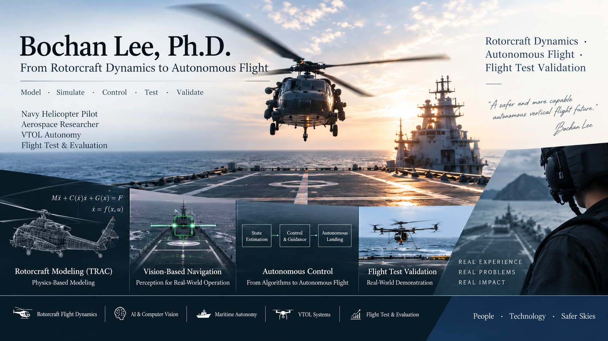
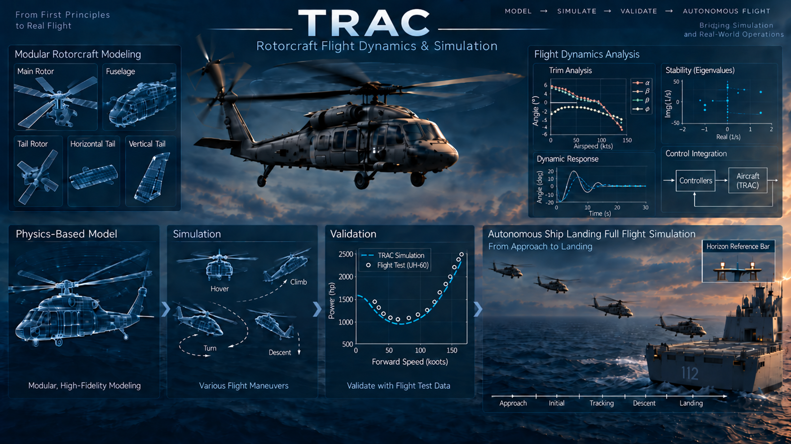
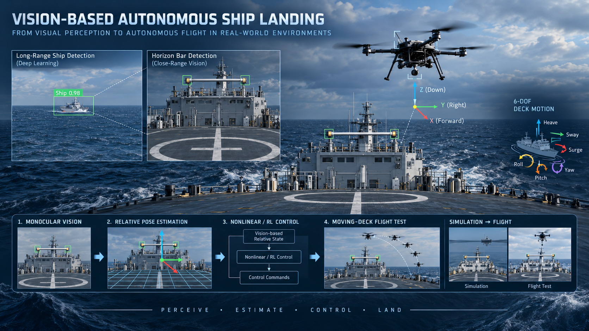

  

<h1 align="center">Bochan Lee, Ph.D.</h1>

  <strong>Rotorcraft Flight Dynamics · VTOL Autonomy · Flight Control · Flight Test & Evaluation</strong>

  Aerospace Engineer · Naval Aircraft Test & Evaluation · Former UH-60 Pilot

  <a href="https://scholar.google.com/citations?user=--PAAeAAAAAJ&hl=en&oi=ao">Google Scholar</a>

---

## Research Profile

**Bochan Lee, Ph.D.** is an aerospace engineer specializing in rotorcraft flight dynamics, autonomous VTOL systems, flight control, computer vision, reinforcement learning, and flight-test validation.

The research portfolio integrates **physics-based modeling, numerical simulation, intelligent control, experimental evaluation, and operational aviation experience** to develop autonomous vertical-flight technologies capable of transitioning from analytical models to real-world flight.

Current professional responsibilities center on **naval aircraft test and evaluation**, supported by prior experience in unmanned-aircraft program management, operational aviation, and UH-60 helicopter flight operations.

### Core Expertise

`Rotorcraft Flight Dynamics` · `VTOL Autonomy` · `Flight Control` · `Computer Vision` · `Machine Learning` · `Reinforcement Learning` · `Flight Testing`

---

# Featured Research

## TRAC — Texas A&M University Rotorcraft Analysis Code

  

**TRAC** is a modular rotorcraft flight-dynamics modeling and simulation framework developed to connect comprehensive helicopter modeling with flight-control analysis, validation, and autonomous-flight simulation.

A UH-60 helicopter serves as the baseline configuration. Major aircraft components are modeled independently and integrated into a complete nonlinear flight-dynamics framework.

### Core Capabilities

| Area | Capability |
|---|---|
| Rotorcraft Modeling | Main rotor, tail rotor, fuselage, horizontal tail, and vertical tail |
| Trim Analysis | Hover, forward flight, climb/descent, and coordinated turning flight |
| Flight Dynamics | Nonlinear dynamic response prediction |
| Linearization | Linearized flight-dynamics models at multiple flight conditions |
| Stability Analysis | Dynamic modes and eigenvalue analysis |
| Simulation | Various helicopter flight maneuvers |
| Control Integration | Integration of flight-control systems with the aircraft model |
| Validation | Comparison with U.S. Army UH-60 flight-test data |
| Autonomous Flight | Full-flight autonomous ship-landing simulation |

The modular architecture allows individual aircraft components to be modified or replaced, enabling the investigation of different rotorcraft configurations without rebuilding the complete simulation framework.

Validation against UH-60 flight-test data provides the foundation for extending the model from conventional flight-dynamics analysis to control-system development and autonomous-flight simulation.

> **Code Availability**
>
> The complete TRAC source code is not currently publicly released.  
> Technical documentation, validation results, selected demonstrations, examples, and selected portions of the implementation will be released progressively.

### [TRAC / Rotorcraft Flight Dynamics Repository](https://github.com/bochanlee-git/rotorcraft-flight-dynamics-sim)

---

## Vision-Based Autonomous Ship Landing

  

**Vision-Based Autonomous Ship Landing** translates established naval helicopter ship-landing procedures into an integrated autonomous VTOL flight architecture.

The system combines long-range machine-vision detection, close-range horizon-reference-bar tracking, relative navigation, nonlinear and learning-based control, moving-platform tracking, and real-world flight testing.

### Autonomous Flight Architecture

**Long-Range Ship Detection**  
↓  
**Horizon Reference Bar Detection**  
↓  
**Relative Position & Attitude Estimation**  
↓  
**Flight Guidance & Control**  
↓  
**Moving-Platform Tracking**  
↓  
**Autonomous Vertical Landing**

### Research Components

- monocular-camera-based relative navigation
- machine-learning-based long-range ship detection
- classical computer vision for horizon-reference-bar tracking
- relative position and orientation estimation
- gain-scheduled flight control
- nonlinear control
- deep reinforcement learning
- disturbance-rejection control
- six-degree-of-freedom moving-deck simulation
- autonomous UAV flight testing
- simulation-to-flight validation

The research progressed from **rotorcraft modeling and full-flight simulation to onboard vision, autonomous control, moving-deck experiments, and flight-test demonstration**.

---

# Selected Research & Engineering Highlights

| Area | Highlight |
|---|---|
| Rotorcraft Flight Dynamics | Developer of the Texas A&M University Rotorcraft Analysis Code (TRAC) |
| Autonomous Flight | Vision-based autonomous VTOL approach and ship-landing systems |
| Flight Testing | Experimental validation of autonomous landing and disturbance-rejection systems |
| Aircraft Test & Evaluation | Naval aircraft test and evaluation |
| Operational Aviation | Former UH-60 helicopter pilot with maritime aviation experience |
| Intellectual Property | Two granted U.S. aerospace patents |
| Personal Air Vehicle | Boeing GoFly Prize Phase I and Phase II winning team |
| Academic Recognition | VFS awards, fellowships, and Vertical Flight Foundation scholarships |

---

# Research Areas

## Rotorcraft Flight Dynamics

Physics-based modeling, analysis, simulation, and validation of helicopter and vertical-flight aircraft.

`Rotor Dynamics` · `Trim Analysis` · `Stability` · `Dynamic Response` · `Flight Simulation` · `Model Validation`

---

## Autonomous VTOL Systems

Autonomous operation of rotorcraft and VTOL aircraft in complex, uncertain, and dynamically moving environments.

`Autonomous Flight` · `Ship Landing` · `Maritime VTOL` · `Trajectory Tracking` · `GPS-Denied Operations`

---

## Guidance & Flight Control

Development and evaluation of conventional, nonlinear, optimal, and learning-based control architectures.

`PID` · `Gain Scheduling` · `LQR` · `Nonlinear Control` · `Trajectory Control` · `Learning-Based Control`

---

## AI & Computer Vision for Aerospace

Integration of perception, state estimation, and intelligent decision-making with flight-control systems.

`Computer Vision` · `Object Detection` · `Relative Pose Estimation` · `Machine Learning` · `Deep Reinforcement Learning`

---

# Operational & Flight-Test Perspective

Operational aviation, analytical modeling, simulation, control-system development, and flight testing are treated as parts of a single aerospace engineering process:

**Aircraft Physics → Flight Characteristics → Modeling → Control → Simulation → Test & Evaluation → Operational Application**

This approach emphasizes engineering solutions that remain meaningful beyond numerical simulation.

Particular attention is placed on **simulation-to-flight correlation, aircraft behavior, control-system robustness, operational constraints, and experimental validation**.

---

# Patents

## US 12,110,129

### Autonomous Landing Systems and Methods for Vertical Landing Aircraft

**Lead Inventor:** Bochan Lee  
**Co-Inventor:** Moble Benedict  
**Granted:** October 8, 2024

Vision-based autonomous landing technology for vertical-flight aircraft operating in challenging and dynamically moving environments.

---

## US 12,269,586

### Hover-Capable Aircraft

**Co-Inventor:** Bochan Lee  
**Granted:** April 8, 2025

Hover-capable personal-air-vehicle technology developed through advanced vertical-flight aircraft research.

---

# Selected Publications

### 2025

**Robust Reinforcement Learning Control for Vision-Based Ship Landing of VTOL-UAVs**  
*Journal of the American Helicopter Society, 70(2)*

Robust reinforcement-learning control for vision-based autonomous VTOL ship landing under environmental disturbances.

---

### 2023

**Development of “Aria,” a Compact, Quiet Personal Electric Helicopter**  
*Journal of the American Helicopter Society, 68(4)*

Design, modeling, development, and flight testing of a compact coaxial electric personal air vehicle.

---

**Intelligent Vision-Based Autonomous Ship Landing of VTOL UAVs**  
*Journal of the American Helicopter Society, 68(2)*

Integrated machine vision, relative navigation, nonlinear control, and flight testing for autonomous ship landing.

---

### 2022

**Biomimetic Adaptive Airframe Technology (BAAT) for Rotorcraft Design and Optimization**  
*VFS 78th Annual Forum*

Rotorcraft design and optimization research involving adaptive-airframe concepts.

---

### 2021

**Machine Learning Vision and Nonlinear Control Approach for Autonomous Ship Landing of Vertical Flight Aircraft**  
*VFS 77th Annual Forum*

Machine-learning-based long-range perception combined with close-range visual navigation and nonlinear flight control.

---

**A Deep Reinforcement Learning Control Strategy for Vision-Based Ship Landing of Vertical Flight Aircraft**  
*AIAA AVIATION Forum*

Deep reinforcement-learning control for autonomous ship landing under moving-deck and wind-disturbance conditions.

---

### 2020

**A Vision-Based Control Method for Autonomous Landing of Vertical Flight Aircraft on a Moving Platform Without Using GPS**  
*VFS 76th Annual Forum*

Vision-based relative navigation and autonomous control for VTOL landing on moving platforms.

---

**Development and Validation of a Comprehensive Helicopter Flight Dynamics Code**  
*AIAA SciTech Forum*

Development and validation of TRAC using comprehensive UH-60 modeling and U.S. Army flight-test data.

---

### Graduate Research

**On the Complete Automation of Vertical Flight Aircraft Ship Landing**  
Ph.D. Dissertation, Texas A&M University, 2021

**Helicopter Autonomous Ship Landing System**  
M.S. Thesis, Texas A&M University, 2018

Full publication record available through **Google Scholar**.

---

# Awards & Recognition

- **Best Paper Award in eVTOL / Vehicle Design — VFS 77th Annual Forum**
- **Ph.D. Graduate Excellence Fellowship — Texas A&M University**
- **Robert L. Lichten Award — 2nd Place**
- **Boeing GoFly Prize — Phase II Winner**
- **Boeing GoFly Prize — Phase I Winner**
- **Barry J. Baskett Scholarship — Vertical Flight Foundation**
- **Wei Chong (Ben) Sim Memorial Scholarship — Vertical Flight Foundation**

---

# Academic Service

### Journal Peer Review

**27 completed reviews across six journals**

- Pattern Recognition
- Aerospace Science and Technology
- Journal of Aircraft
- Neurocomputing
- Robotics and Autonomous Systems
- Ain Shams Engineering Journal

---

# Technical Expertise

### Flight Sciences

`Rotorcraft Flight Dynamics` · `Rotor Aerodynamics` · `Aircraft Dynamics` · `Stability & Control` · `Flight Testing`

### Modeling & Simulation

`Nonlinear Modeling` · `Numerical Simulation` · `Trim Analysis` · `Linearization` · `Flight Simulation`

### Autonomous Systems

`VTOL Autonomy` · `Guidance` · `Navigation` · `Autonomous Landing` · `Moving-Platform Tracking`

### Intelligent Systems

`Computer Vision` · `Machine Learning` · `Reinforcement Learning` · `Object Detection` · `Visual Navigation`

### Computational Tools

`MATLAB` · `Python` · `C++` · `LabVIEW` · `OpenCV` · `Arduino` · `Gazebo` · `X-Plane`

---

# Selected Professional Experience

### Naval Aircraft Test & Evaluation Officer
**Joint Chiefs of Staff, South Korea**  
2026–Present

Aircraft test, evaluation, and operational capability assessment.

### Unmanned Aerial Vehicle Program Manager
**Republic of Korea Navy Headquarters**

Program management for unmanned aerial systems and future naval aviation capabilities.

### Graduate Research Assistant
**Advanced Vertical Flight Laboratory**

Research in rotorcraft flight dynamics, flight control, autonomous VTOL systems, computer vision, machine learning, and flight testing.

### Co-Founder / Flight Simulation & Test Safety Lead
**Harmony Aeronautics — Boeing GoFly Prize**

Flight-dynamics modeling, simulation, and flight-test safety for the Harmony Aria personal aerial vehicle.

### UH-60 Helicopter Pilot
**Republic of Korea Navy**

Operational rotary-wing aviation with specialization in maritime missions.

---

# Education

### Texas A&M University

**Ph.D., Aerospace Engineering**  
2018–2021

Research areas:

`Rotorcraft Flight Dynamics` · `Autonomous Ship Landing` · `Flight Control` · `Computer Vision` · `Reinforcement Learning` · `Flight Testing`

---

### Texas A&M University

**M.S., Aerospace Engineering**  
2016–2018

Research areas:

`Helicopter Flight Dynamics` · `UH-60 Modeling & Simulation` · `Autonomous Ship Landing`

---

### Republic of Korea Naval Academy

**B.S., Operations Research**  
**B.S., Military Science**  
2006–2010

---

# Research Direction

Research activities are directed toward **intelligent, reliable, and operationally relevant vertical-flight systems** through the integration of:

**Physics-Based Modeling → Perception → State Estimation → Guidance & Control → Machine Learning → Flight-Test Validation**

Primary application areas include:

- next-generation rotorcraft
- autonomous VTOL systems
- maritime aviation
- intelligent flight control
- GPS-denied navigation
- autonomous landing
- simulation-to-flight transfer
- aircraft test and evaluation

---

  <strong>From Rotorcraft Dynamics to Autonomous Flight</strong>

  Model · Simulate · Control · Test · Validate

